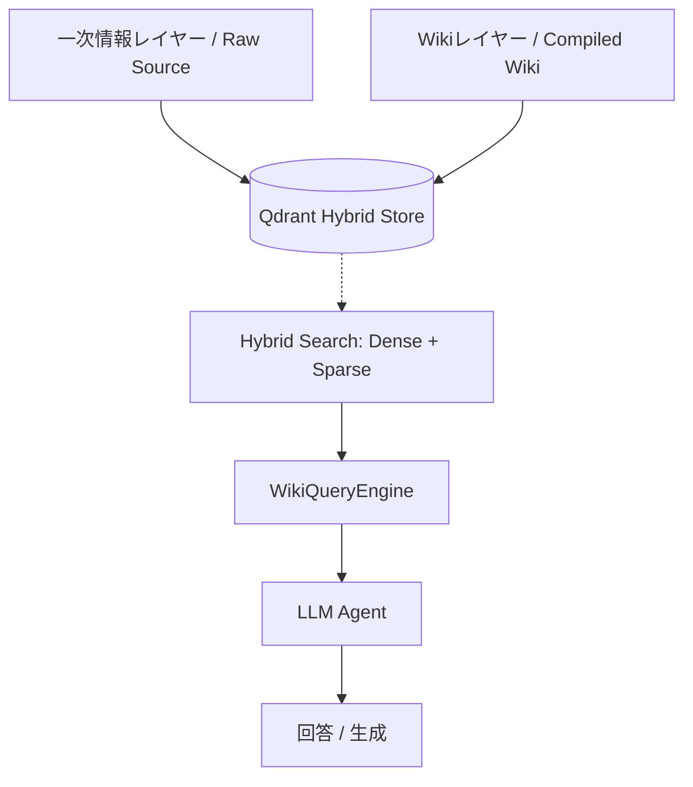

# アーキテクチャ解説 (Architecture v2.1)

本プロジェクトは、情報の使い捨てを防ぎ、永続的な知識ベース（Wiki）を構築・維持するための **"Wiki-Native RAG"** アーキテクチャを採用しています。

---

## 1. 全体像：ハイブリッド・インデックス

RAG-Wikiは、Qdrant内に「性質の異なる2つのレイヤー」を共存させることで、高い信頼性と深い洞察の両立を実現します。

### A. 一次情報レイヤー (Raw Source)
- **内容**: Doclingにより高精度にパースされたPDF等の生テキスト。
- **役割**: 数値、固有名詞、注釈などの「消えてはならない事実」の保管庫。

### B. Wikiレイヤー (Compiled Wiki)
- **内容**: 人間がレビュー・承認し、AIが要約・統合した構造化Markdown。
- **役割**: 概念間の繋がり、全体像の把握、および「人間の考察」の保管庫。

---

## 2. メタデータ統治 (Metadata Governance Layer)

本システムの最大の特徴は、自由記述のMarkdownでありながら、**Pydanticによる厳格なデータバリデーション**を備えている点です。

- **Schema Enforcement**: `core/schemas.py` で定義された `WikiFrontmatterSchema` が、全ページのメタデータ（タグ、エイリアス、要約）の構造を強制します。
- **Quality Control**: バリデータにより、無意味な要約（スタブ）や不適切なエイリアス（関連用語の混入）を自動的に検知・排除します。
- **Normalization**: 出力時にタグやエイリアスを自動的にアルファベット順にソートし、重複を排除することで、知識グラフの「汚れ」を防ぎます。

---

## 3. ワークフロー：Obsidian-Native HITL

「AIはドラフトを書き、人間がIDE（Obsidian）で承認し、手動で同期する」という、疎結合で堅牢なワークフローです。

1.  **Ingestion**: `main.py` にファイルを渡すと、AIが内容を分析。
2.  **Drafting**: 既存のWikiと一次情報を参照し、新規ドラフトを `wiki/` 直下に作成。この際、必ず `tags: [未審査]` が付与されます。
3.  **Review (Obsidian)**: ユーザーはObsidian上で内容を修正し、納得がいけば `未審査` タグを消去。
4.  **Synchronization**: `main.py --sync` を実行。Pydanticバリデータをパスし、かつタグが外れたページのみがベクトル化され、Gitにコミットされます。

---

## 4. 分離型リポジトリ設計 (Decoupled Repository Design)

知識ベース（Wiki）とソースコードの履歴を完全に分離するため、本プロジェクトは二重リポジトリ構造を採用しています。

- **Main Repository (Root)**: 
  - エージェントのロジック、プロンプト、インフラ設定を管理。
  - `wiki/` ディレクトリは `.gitignore` により完全に除外。
- **Knowledge Repository (`wiki/`)**: 
  - `wiki/` フォルダ自体が独立したGitリポジトリとして動作。
  - AIによる自動執筆や人間による承認の履歴のみを記録。
  - **メリット**: コードの履歴をクリーンに保ちつつ、知識ベースだけを別の環境（GitHub Pagesや他のObsidian環境）へ容易にデプロイ・同期可能。

---

## 5. 自律的メンテナンス (Maintenance Logic)

### Red Links (Automatic Repair)
Wiki内に存在するが実体のないリンク `[[ページ名]]` を見つけ、ベクトルDBの証拠、またはLLMの内部知識を動員して自動的に高品質なドラフトを作成します。

### Semantic Merge
既存ページに情報を追記する際、AIは既存の文章を破壊せず、差分を `> [!info] AIからの更新提案` として挿入します。これにより、人間が書いた情報を常に最優先（Human-First）に保ちます。

---

## 5. 設計思想：人間優先 (Human-First Design)

- **ObsidianをIDEとする**: 独自のUIを作らず、Obsidianを「開発環境」として利用します。
- **ポータブルな運用**: Qdrant Localモードの採用により、Docker不要で、USBメモリやクラウドストレージ経由でナレッジベースを持ち運ぶことが可能です。
- **不変の事実と流動的な知見**: 一次情報レイヤー（不変）とWikiレイヤー（流動・成長）を分けることで、RAGの精度と柔軟性を両立させています。

---

## 6. 技術詳細
詳細なモジュール設計については以下のドキュメントを参照してください。
- [RAG QA Engine (WikiQueryEngine)](./RAG_QA_ENGINE.md)
- [Wiki Generation Rules](./WIKI_GENERATION_RULES.md)
