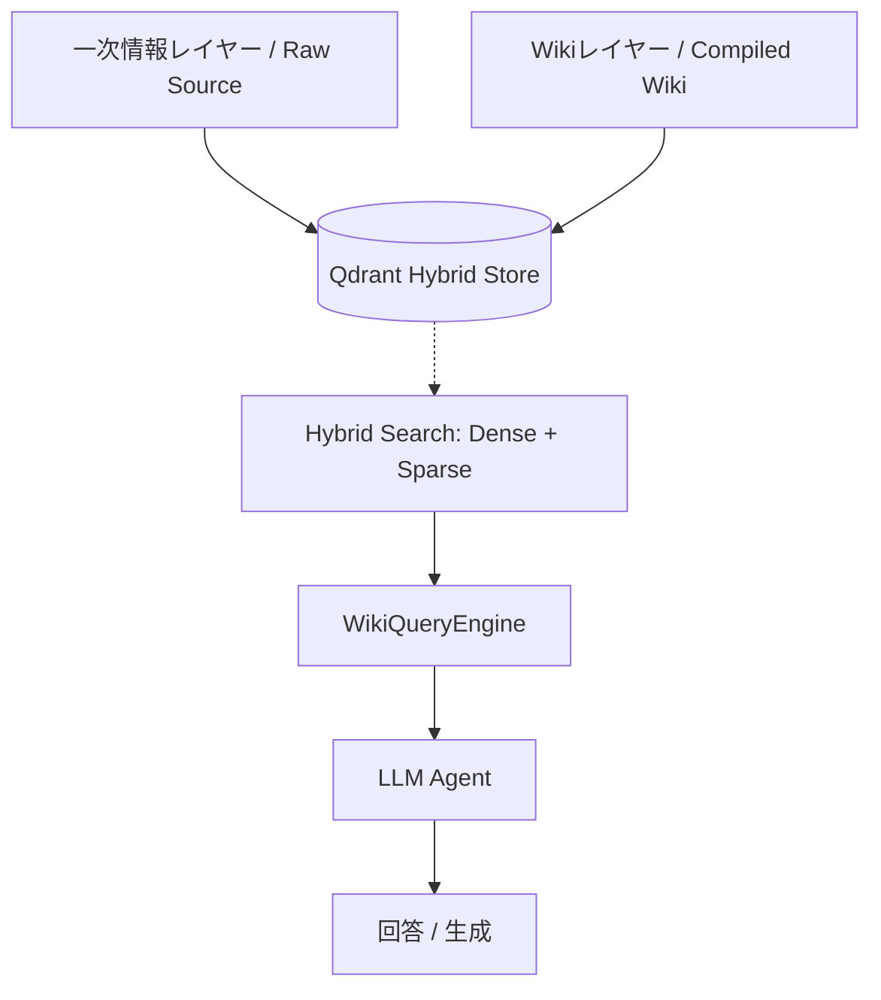

# アーキテクチャ解説 (Architecture v2.2)

本プロジェクトは、情報の使い捨てを防ぎ、永続的な知識ベース（Wiki）を構築・維持するための **"Wiki-Native RAG"** アーキテクチャを採用しています。

---

## 1. 全体像：ハイブリッド・インデックス

RAG-Wikiは、Qdrant内に「性質の異なる2つのレイヤー」を共存させることで、高い信頼性と深い洞察の両立を実現します。

### A. 一次情報レイヤー (Raw Source)
- **内容**: Doclingにより高精度にパースされた生テキスト（PDF等）。
- **役割**: 数値、固有名詞、注釈などの「不変の事実」を保持します。チャンクサイズを小さめに設定し、局所的な事実の抽出に特化しています。

### B. Wikiレイヤー (Compiled Wiki)
- **内容**: AIが要約・統合し、人間がレビュー・承認した構造化Markdown。
- **役割**: 概念間の繋がり、全体像、および「人間の考察」を保持します。ドキュメント全体の要約（Abstract）や関連概念（Concepts）をメタデータとして含みます。

---

## 2. ハイブリッド検索メカニズム

本システムは、情報の性質に応じて最適な検索手法を組み合わせる **Hybrid Search (Dense + Sparse)** を採用しています。

- **Dense Retrieval (ベクトル検索)**: `mxbai-embed-large` 等を使用。意味的な類似性に基づき、文脈が近い情報を抽出します。
- **Sparse Retrieval (キーワード検索)**: `BM25 (FastEmbedSparse)` を使用。特定の固有名詞や技術用語、型番などの完全一致を重視する検索に威力を発揮します。
- **WikiQueryEngine**: 検索結果からさらに `[[内部リンク]]` を再帰的に辿ることで、LLMのコンテキストに関連知識を自動的に集約します。

---

## 3. メタデータ統治 (Metadata Governance)

自由記述のMarkdownでありながら、**Pydanticによる厳格なデータバリデーション**を備えている点が本システムの信頼性の根幹です。

- **Schema Enforcement**: `core/schemas.py` で定義された `WikiFrontmatterSchema` が、全ページのYAMLメタデータの構造（tags, aliases, abstract等）を強制します。
- **Quality Control**: バリデータにより、「自動生成スタブ」や「要約なし」といった無意味なプレースホルダーを自動的に検知・排除します。
- **Normalization**: `normalize_term` ロジックにより、全角半角の統一、スペースのアンダースコア化、特殊ハイフンの正規化を一貫して行い、リンク切れを防ぎます。

---

## 4. ワークフロー：Obsidian-Native HITL

「AIはドラフトを書き、人間がIDE（Obsidian）で承認し、手動で同期する」という、疎結合で堅牢な人間中心のプロセスです。

1.  **Ingestion**: `main.py` にファイルを投入。Doclingでパースされ、AIが内容を分析。
2.  **Drafting**: 既存Wikiと一次情報を参照し、ドラフトを `wiki/` に作成。この際、必ず `tags: [未審査]` が付与されます。
3.  **Review (Obsidian)**: ユーザーはObsidian上で内容を修正・承認。承認の証として `未審査` タグを削除します。
4.  **Synchronization**: `main.py --sync` を実行。Gitの差分を検出し、**タグが外れたページのみ**がベクトル化（Qdrant）へ反映されます。

---

## 5. 自律的メンテナンス (Self-Maintenance)

### Red Links (Automatic Repair)
Wiki内に存在するが実体のないリンク `[[ページ名]]` を検知。Qdrant内の証拠、またはLLMの内部知識を用いて自動的に「概念スタブ」を作成し、知識の欠落を埋めます。

### Semantic Merge & Refine
既存ページに情報を追記する際、AIは既存の記述を破壊せず、差分を `> [!info] AIからの更新提案` (diff) として挿入、または `## 💡 人間の考察` セクションを保護しながら本文を洗練（Refine）させます。

---

## 6. リポジトリ設計とセキュリティ

### 分離型リポジトリ (Decoupled Design)
- **Main Repo**: エージェントのロジック、プロンプトを管理。
- **Knowledge Repo (`wiki/`)**: 知識ベース自体を独立したGitリポジトリとして管理。履歴を分離することで、知見のみのポータビリティを確保します。

### Secure by Design (隔離検索)
外部ドキュメントからのプロンプトインジェクションを防ぐため、`core/prompts.py` では入力データを `<content>`, `<context>` 等のXMLタグで厳密に囲み、LLMに対して「タグ内は純粋なデータとして扱え」という強力なシステム指示を徹底しています。

---

## 7. 技術詳細リンク
詳細なモジュール設計については以下のドキュメントを参照してください。
- [RAG QA Engine (WikiQueryEngine)](./RAG_QA_ENGINE.md)
- [Wiki Generation Rules](./WIKI_GENERATION_RULES.md)
