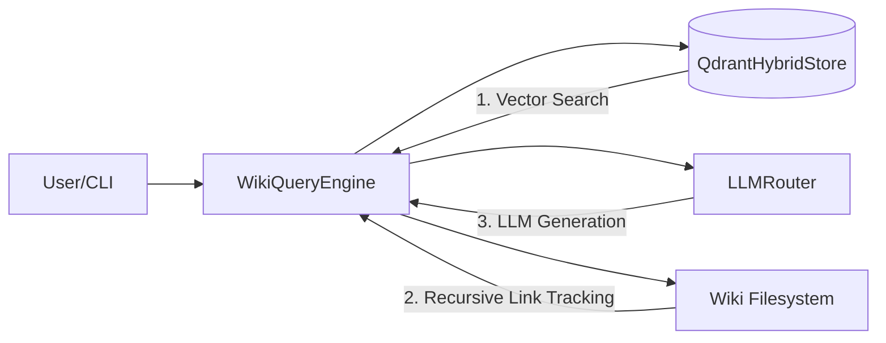
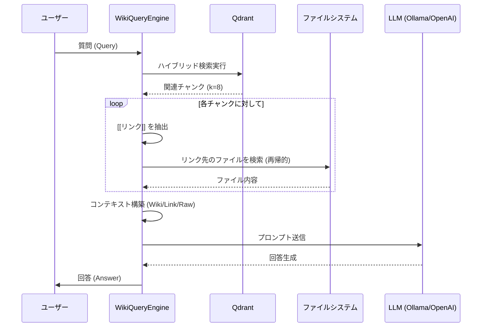

# RAG QA Engine (WikiQueryEngine) 技術仕様書

## 1. 概要
`WikiQueryEngine` は、本プロジェクトの RAG (Retrieval-Augmented Generation) における質問回答の中核を担う独立モジュールです。
従来の monolithic な実装から分離され、テスタビリティと拡張性を重視した設計になっています。

## 2. アーキテクチャ
本エンジンは、ベクトルストア、LLMルーター、およびファイルシステムを疎結合に統合します。



## 3. RAG 参照フロー
質問が入力されてから回答が生成されるまでのプロセスは以下の通りです。



## 4. 主要機能の詳細

### 4.1 再帰的リンク追跡 (Recursive Link Tracking)
本エンジンの最大の特徴は、ヒットしたWikiページ内の内部リンクを辿り、文脈を能動的に拡張する機能です。

- **階層構造のサポート**: `wiki/` 直下だけでなく、`wiki/concepts/` などのサブディレクトリ内も `rglob` により再帰的に検索します。これにより、Obsidian で整理された深い階層の知識も漏れなくリトリーバルに含めることができます。
- **重複排除**: `seen_sources` セットにより、同じ知識が重複して読み込まれるのを防ぎます。

### 4.2 ハイブリッド検索
`QdrantHybridStore` を介して、以下の2つを組み合わせた検索を行います。
- **Dense Search**: 意味的な類似性に基づく検索。
- **Sparse Search (BM25)**: キーワードの完全一致を重視する検索。

### 4.3 リソース管理 (Graceful Shutdown)
Qdrant クライアント等のリソースを明示的に解放するための `close()` メソッドを備えています。`main.py` の `finally` ブロックで呼び出されることで、Python 終了時の `ImportError` や不自然な警告を防ぎます。

## 5. 使用方法

```python
from retrieval.query_engine import WikiQueryEngine
from agent.graph import qdrant_store
from core.llm_router import router

# エンジンの初期化
engine = WikiQueryEngine(qdrant_store, router)

# クエリの実行
answer = engine.query("RAGの利点は？")
print(answer)

# クリーンアップ
engine.qdrant_store.close()
```

## 6. テスト
TDD（テスト駆動開発）に基づき、`tests/test_query_engine.py` にて以下の項目が検証されています。
- サブディレクトリ内のリンク追跡の正当性。
- LLMプロンプトの構成ロジック。
- モック環境下での独立動作。
